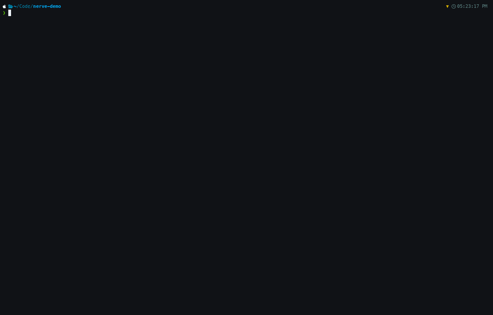

# nerve

[](https://github.com/mascah/nerve/actions/workflows/ci.yml)
[](LICENSE)



**Run your whole stack in every parallel worktree.** nerve lets an AI coding agent spin up git worktrees on the fly and bring your full stack up in each one — `docker compose` with a dozen containers, dev servers, `direnv` — with zero per-worktree config and no port collisions. Harness-agnostic core for any agent (Claude Code, Codex, Cursor, …) or plain manual use; first-class Claude Code integration.

## The problem

Creating a worktree is the easy part — *running* it is where things break. The moment an agent spins up a second worktree and runs `docker compose up`, everything collides: both worktrees want the same Postgres, Redis, and app ports; `.env` isn't there; direnv silently doesn't apply. Tools that create worktrees punt on the runtime environment, so you're left patching ports by hand or writing fragile scripts that break across machines.

## What nerve does

With nerve installed, Claude can call `EnterWorktree` mid-session, run your full `docker compose` stack in that worktree, and it runs clean — in parallel with every other worktree, with direnv and `.env` intact. You stop thinking about ports.

> Mid-session `EnterWorktree` worktrees need a one-time `nerve hooks install --bash-preamble` so per-command env (ports + direnv) loads into the session. See [Claude Code](#claude-code) for why.

For each new worktree it:

1. **Allocates a non-conflicting port set** so the whole stack can come up alongside your other worktrees — offset-based, not random (see [Predictable, explicit ports](#predictable-explicit-ports)).
2. **Copies dotfiles** (`.env`, `.npmrc`, etc.) you declare in `clone_files`.
3. **Renders templates** with per-worktree port vars so every worktree gets its own `.env.local`.
4. **Runs bootstrap hooks** (`post_create`) — `uv sync`, `pnpm install`, `bundle install` — instead of copying gigantic directories between worktrees.
5. **Registers the allocation** in a flock-guarded registry so two concurrent `nerve new` calls never collide, and ports held by other projects in your registry are avoided automatically.

The harness-agnostic core (`nerve new`) works standalone. A first-class Claude Code integration is available separately (see [Integrations](#integrations)).

## Predictable, explicit ports

Collision-free ports are the point; making them *predictable* is the bonus. Other tools hash branch names into the port range; nerve uses explicit offset arithmetic instead. For offset N in `[1, pool_size]`, each service's port is `base_port + project_offset + N` — same collision-avoidance, but deterministic:

- **Predictable URLs.** Worktree 3's services are always at offset 3 — bookmark `http://localhost:8003`, share it with a teammate, and it still works tomorrow.
- **No port thrash.** Restarting a worktree or re-running `nerve env` doesn't reassign ports.
- **Cross-project isolation.** The registry tracks leases across all your nerve-managed repos, so a port claimed by `project-a:worktree-2` is never given to `project-b:worktree-5`.
- **Squatter detection.** Before finalising an offset, nerve probes each candidate port with a short `net.Listen`. An offset where any service port is already bound by an external process is skipped.

## Install

**Build from source** (requires Go 1.26+):

```bash
git clone https://github.com/mascah/nerve
cd nerve
make install   # → $GOPATH/bin/nerve
```

**Homebrew** (installs a prebuilt binary — no compile, no Go toolchain; macOS + Linux, arm64 + amd64):

```bash
brew install mascah/tap/nerve
```

**Download a release archive:** prebuilt `tar.gz` for darwin/linux × arm64/amd64, plus `checksums.txt`:

```
https://github.com/mascah/nerve/releases
```

## Quick start

```bash
# From inside your repo: scaffold .nerve/config.yaml AND register the repo with nerve.
# `nerve init` writes a static, commented config file (it is NOT interactive) and
# auto-registers the main checkout in the global registry.
cd ~/Code/my-app && nerve init

# Edit .nerve/config.yaml to declare your services (uncomment the `services:` block).

# Create a worktree — nerve allocates ports, copies dotfiles, runs post_create hooks.
# From inside a registered repo the project is inferred, so the name is optional:
nerve new feat-foo            # same as: nerve new my-app feat-foo

# Inspect what was allocated
nerve list my-app

# See the env vars for the current worktree
nerve env
```

> To register a repo that lives **elsewhere on disk** (without `cd`-ing into it to run `nerve init`), use `nerve project add ~/Code/my-app`.

## Layout

| Path | Purpose |
|---|---|
| `<repo>/.nerve/config.yaml` | Per-project config: services, clone files, templates, lifecycle hooks |
| `<repo>/.nerve/ports.json` | Port allocation registry (gitignored, flock-guarded) |
| `<repo>/.worktrees/<branch>/` | Worktrees live here (gitignored) |
| `~/.config/nerve/projects.yaml` | Global project registry (respects `$XDG_CONFIG_HOME`) |

## Config schema (`<repo>/.nerve/config.yaml`)

`nerve init` writes a richly-commented version of this with only `version:` + `project:` active and every other section shown commented; uncomment what you need. The schema below is canonical (it matches the init scaffold and the structs exactly — copy-paste it as-is):

```yaml
version: 1

project:
  port_offset: 0                      # base offset added to every service port for this project
  pool_size: 10                       # max simultaneous worktrees
  worktree_root: ".worktrees/{branch}"
  # background_remove: false          # opt-in: return from teardown immediately (trash + delete in background)
  # bash_preamble: ""                 # opt-in: shell snippet `nerve bash-preamble` prepends to Bash
                                      # commands in a worktree (default: nerve's port exports).
                                      # e.g. eval "$(direnv export bash 2>/dev/null)" — see Integrations.

# Network-bound components whose ports are offset per worktree. At most one `primary`.
services:
  - id: django
    base_port: 8000
    env_key: DJANGO_PORT
    primary: true
  - id: postgres
    base_port: 5432
    env_key: DATABASE_PORT
  - id: vite
    base_port: 5173
    env_key: VITE_PORT

# Static per-worktree env values written to .env.local alongside the service ports.
# `value` is rendered through the {{...}} engine (see template variables below).
vars:
  - { env_key: WORKTREE_ID, value: "{{branch}}" }

# Files (or directories) copied verbatim from the main checkout into each new worktree.
# `kind` is `file` (default) or `directory`; `required: true` fails create if missing.
clone_files:
  - { path: .env,   kind: file, required: true }
  - { path: .npmrc, kind: file, required: false }

# Source files rendered with single-brace substitution into the worktree. With
# `merge: true` the dest is treated as a dotenv file (existing keys kept, new keys appended).
templates:
  - { source: .env.example, dest: .env.local, merge: true }

hooks:
  post_create:
    - direnv allow                    # bare string → foreground (sync, blocks boot)
    - { run: uv sync, background: true }      # mapping with background: true → detached, concurrent
    - { run: pnpm install, background: true }
  pre_remove:
    - "echo pre-remove ran"
```

**Template variables.** Two engines, same variable names:

- `project.worktree_root` and `templates[].source` file bodies use **single-brace** substitution: `{branch}`, `{project}`, `{worktree_path}`, `{branch_slug}`, `{ports.<service-id>}`.
- `vars[].value` is rendered through **double-brace** `{{...}}` Go-style templating: `{{branch}}`, `{{project}}`, `{{worktree_path}}`, `{{branch_slug}}`, `{{ports.<service-id>}}`.

**Lightweight mode:** if `.nerve/config.yaml` is absent (or present with no `services:`), `nerve new` still creates a plain git worktree with no port allocation or file copying. A fresh `nerve init` is lightweight until you uncomment `services:`.

## Commands

| Command | Purpose |
|---|---|
| `nerve init` | Scaffold a commented `.nerve/config.yaml` and auto-register the repo (`--no-register` to skip, `--name`/`--default-base` mirror `project add`) |
| `nerve project add/list/remove` | Manage global project registry |
| `nerve new [<project>] <branch>` | Create worktree: allocate ports, copy files, run hooks (project defaults to the one enclosing cwd) |
| `nerve remove [<project>] [<branch>]` | Remove worktree: release port, optionally delete branch (no args → cwd worktree; `<branch>` alone → cwd's project) |
| `nerve list [<project>]` | List active worktrees and their allocated ports |
| `nerve env` | Print per-worktree port env vars for current directory |
| `nerve ports list/cleanup/status` | Inspect the port registry |
| `nerve gc [<project>]` | Clear leftover bytes in `.nerve/trash` (from an interrupted `background_remove`) |
| `nerve refresh` | Re-render templates + env in the current worktree |
| `nerve doctor` | Diagnose config and registry |
| `nerve hooks install` | Wire nerve into Claude Code (see Integrations) |
| `nerve version` | Print nerve version |

`nerve` with no arguments launches the interactive TUI project-setup interface.

## Integrations

### Claude Code

`nerve hooks install` writes four hook entries into Claude Code's settings file, making `claude --worktree <branch>` from a nerve-registered repo Just Work:

| Hook event | Command | Purpose |
|---|---|---|
| `WorktreeCreate` | `nerve worktree-create` | Replaces Claude's default git logic; nerve creates the worktree, allocates ports, copies clone files, and prints the absolute path back to Claude Code |
| `WorktreeRemove` | `nerve worktree-remove --from-hook` | Runs pre-remove hooks, releases the port, deletes the worktree and branch |
| `SessionStart` | `nerve env --inject` | Appends per-worktree port env vars to `$CLAUDE_ENV_FILE` so Bash tool calls see them |
| `CwdChanged` | `nerve env --inject` | Re-injects when the user `cd`s between worktrees mid-session |

After install, `claude --worktree feat-foo` creates the worktree at `<repo>/.worktrees/feat-foo/` (instead of Claude's default `<repo>/.claude/worktrees/`), with ports allocated and env vars live in the session.

> **Known limitation — `EnterWorktree` (mid-session) vs. `--worktree` (launch).** Env injection works on launch (`claude --worktree`). But when Claude creates a worktree *mid-session* via the `EnterWorktree` tool, Claude Code fires only `WorktreeCreate` (not `CwdChanged`/`SessionStart`), and `WorktreeCreate` doesn't receive `$CLAUDE_ENV_FILE` — so the worktree's env isn't loaded into the session. The opt-in `nerve hooks install --bash-preamble` works around this with a `PreToolUse:Bash` hook (`nerve bash-preamble`) that prepends a per-command env load (nerve's port exports by default, or your `project.bash_preamble`, e.g. `eval "$(direnv export bash)"`). See [docs/claude-code-worktree-env.md](docs/claude-code-worktree-env.md) for the root cause, the approaches that don't work, and the full workaround.

#### Fast boot & teardown (opt-in)

For large projects, `post_create` installs (`uv sync`, `pnpm i`) and the recursive delete of `node_modules`/`.venv` on teardown can each take 30+ seconds, and `claude --worktree` blocks on them. You can move that work off the critical path per command and per project.

**Per-command background hooks.** By default every `post_create` hook is **foreground**: it runs synchronously, in order, before the worktree path is reported — so env-shapers like `direnv allow` are in effect before a session starts. Tag a hook with `background: true` to detach it; multiple background hooks run **concurrently**:

```yaml
hooks:
  post_create:
    - direnv allow            # foreground: runs first, blocks boot (correct for env-shapers)
    - run: uv sync
      background: true        # detached
    - run: pnpm install
      background: true        # detached → runs in parallel with uv sync
```

Background hooks run with the allocated ports + identity vars in their environment (same as the synchronous path). Progress and a terminal `running`/`ok`/`failed` status are written under `.nerve/hooks/<branch_slug>/`; `nerve list` and the TUI Worktrees tab show a `HOOKS` column so you can tell when bootstrap finished. A failing background hook is recorded as `failed` (it can't roll back an already-created worktree); a failing foreground hook aborts create and rolls the worktree back. Note the trade-off: an agent could start a dev server before a background `pnpm i` has finished — keep such prerequisites foreground.

> The project-wide `project.background_post_create: true` flag is **deprecated** but still honored as a fallback default for hooks that don't set their own `background:`. Prefer the per-command form above.

**Background teardown** is a separate per-project flag (default `false`):

```yaml
project:
  background_remove: true   # return from teardown immediately; trash + delete the worktree dir in the background
```

- **`background_remove`** — teardown renames the worktree into `.nerve/trash/` (instant) and deletes the bytes in a detached process. git's own metadata is reconciled *synchronously* (`git worktree prune`), so its view never goes out of sync even if the background delete is interrupted; leftovers are swept on the next remove. Falls back to a synchronous delete if the worktree lives on a different filesystem than `.nerve/`. If a detached delete is ever interrupted, `nerve doctor` reports the leftover bytes and `nerve gc` clears them on demand.

#### Install scope

Because not everyone on your team will have nerve installed, `nerve hooks install --project` writes to the **per-user local override** (gitignored) by default:

| Flag | Target file |
|---|---|
| `--project` *(default)* | `<repo>/.claude/settings.local.json` — user-local, gitignored; nerve adds it to `.gitignore` on first install |
| `--shared` | `<repo>/.claude/settings.json` — committed; use only if every collaborator has nerve |
| `--user` | `~/.claude/settings.json` — applies to every repo on your machine |

#### Merge semantics

`nerve hooks install` merges into the target settings file — it never overwrites it. Each nerve-managed command is tagged with the sentinel `# nerve-managed`, and `nerve hooks uninstall` removes only entries carrying that sentinel. Re-running install is idempotent. When you have your own hook for an event nerve also uses (e.g. `SessionStart`), both coexist — nerve appends alongside, it does not replace.

## Releasing

Releases are automated by [release-please](https://github.com/googleapis/release-please) + [goreleaser](https://goreleaser.com/), driven entirely by [Conventional Commits](https://www.conventionalcommits.org/) (`feat:` → minor, `fix:` → patch, `feat!:`/`BREAKING CHANGE:` → major). The whole pipeline lives in `.github/workflows/release.yml`:

1. **Just merge PRs to `main` as usual.** On every push to `main`, release-please opens (or updates) a **release PR** that bumps the version and rewrites `CHANGELOG.md` from the commits since the last release.
2. **Merge the release PR.** Everything else is automatic, in one workflow run:
   - release-please creates the `vX.Y.Z` tag *and* the GitHub Release (notes drawn from `CHANGELOG.md`).
   - goreleaser builds the darwin/linux × arm64/amd64 tarballs + `checksums.txt` and **attaches them to that release** without touching the notes (`release.mode: keep-existing`, its changelog disabled — so the two tools never fight over the changelog).
   - `scripts/update-tap-formula.sh` then regenerates `Formula/nerve.rb` in [mascah/homebrew-tap](https://github.com/mascah/homebrew-tap) from those archives' checksums and pushes it. `brew install mascah/tap/nerve` is now an instant prebuilt-binary install (no compile, no Go toolchain; macOS + Linux). We write the formula ourselves because goreleaser removed formula generation (`brews`) in v2.16 and only emits casks now — and a prebuilt-binary *formula* avoids both the cask quarantine/Gatekeeper hack and the macOS-only limitation.

That's it — no manual tagging, no `bump-formula.sh`, no source-tarball `sha256` step.

### One-time setup

- **`HOMEBREW_TAP_GITHUB_TOKEN`** repo secret — a fine-grained PAT with **Contents: read & write** on `mascah/homebrew-tap` (the workflow's built-in `GITHUB_TOKEN` is scoped to this repo only, so it can't push to the tap). Create it at *GitHub → Settings → Developer settings → Fine-grained tokens*, restricted to that one repo, then add it under *this repo → Settings → Secrets and variables → Actions*.
- No PAT is needed for the release itself: release-please and goreleaser run as two steps of one job, because a tag pushed by the default `GITHUB_TOKEN` won't trigger a separate `on: push: tags` workflow.

A local `goreleaser release --clean` (needs both tokens in the env) still works for ad-hoc runs, but the CI path above is the supported one.
